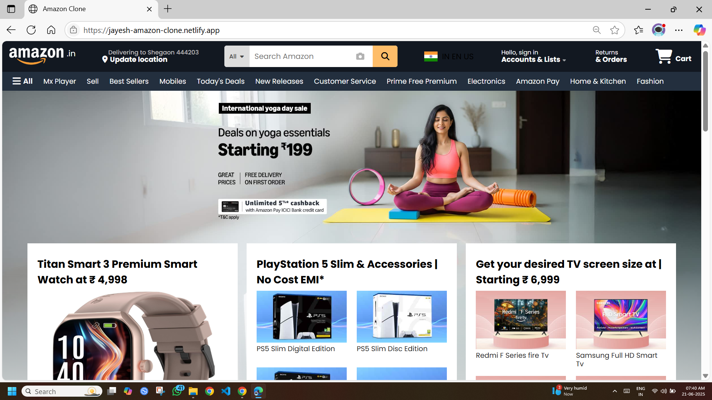

# amazon-clone

This is a fully responsive **Amazon India Clone** made using HTML, CSS, and Font Awesome icons. It mimics the design and layout of Amazon's homepage with a modern and clean user interface.

## 🌐 Live Demo

[Click here to view the live project](https://jayesh-amazon-clone.netlify.app/)

[Netlify](https://jayesh-amazon-clone.netlify.app/)

## 📸 Preview

## ✨ Features

- 🔍 Search bar with icon and camera scan
- 📍 Location update section
- 📦 Product cards with images, descriptions, and links
- 🧭 Navigation bar with menu items
- 🛒 Cart icon and sign-in section
- 🧾 Footer with social links and extra pages
- 📱 Fully responsive layout

## 🛠️ Tech Stack

- HTML5
- CSS3
- Font Awesome (for icons)

## 📂 Folder Structure
amazon-clone/
│
├── index.html
├── styles.css
├── assets/
│ ├── alogo.png
│ ├── ind.jpg
│ ├── watch.jpg
│ ├── card2_1.jpg ... card9_4.jpg
│ └── preview.jpg
└── main-assets/
└── logo.png

